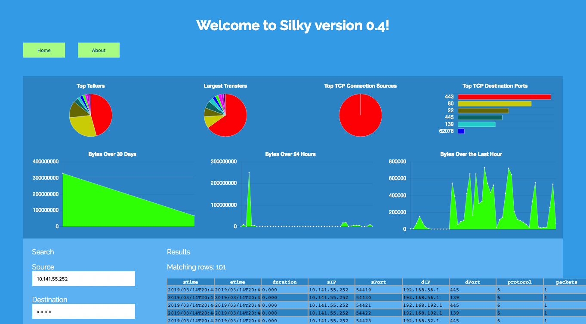

# Silky

This project provides a simple interactive web interface to Netflow data managed within a Silk repository.  Currently, no authentication is provided, but this will be added soon.

## Experimenting

After installing NodeJS onto the Silk repository, start the development version of Silky by running `ng serve --host 0.0.0.0&`.  This will begin serving the Angular interface.  Next, change into the "service" directory and start up the server-side service that runs (currently) on port 3000:  `node service.js`.  The `service.js` file must be started by a user who has the rights to access the Silk repository and the Silk tools must be in this user's execution path.

With these two actions taken, you can now navigate to Navigate to `http://silk.host.com:4200/`, replacing `silk.host.com` with the DNS name or IP address of the repository.

## Future

The next version of Silky will:

* Provide authentication
* Allow you to serve the entire application from the `service.js` application
* Operate over TLS
* Allow limited arbitrary searches
* Provide an FFT analysis of periodic traffic flows in an attempt to identify beaconing activities

